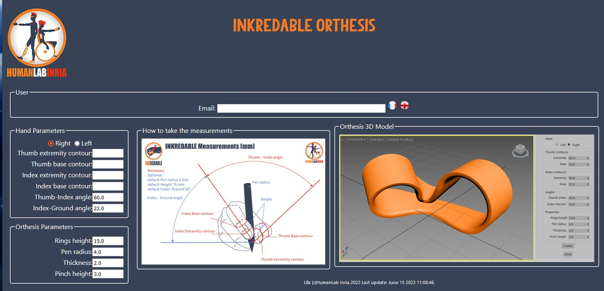
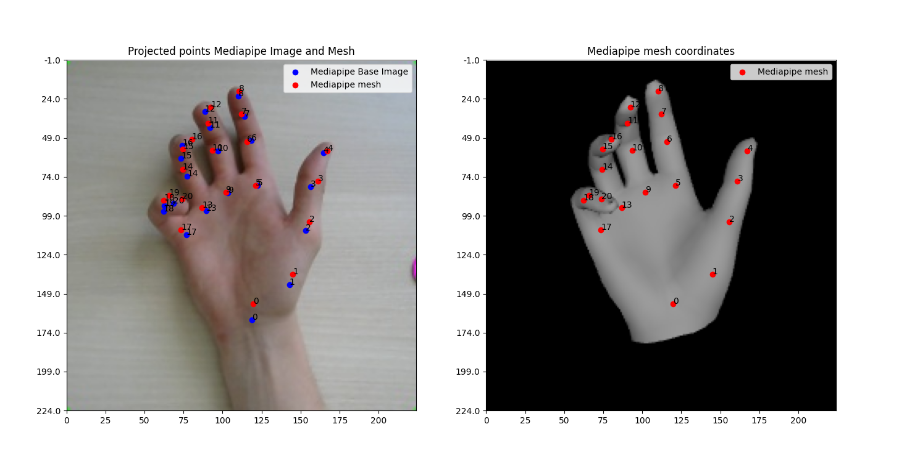
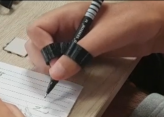
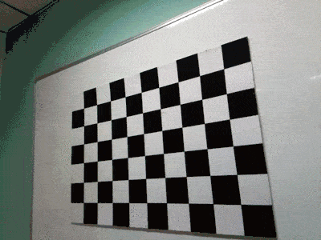
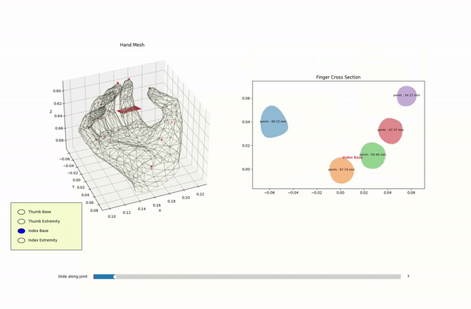
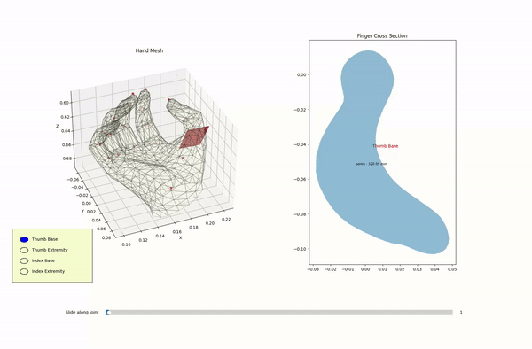
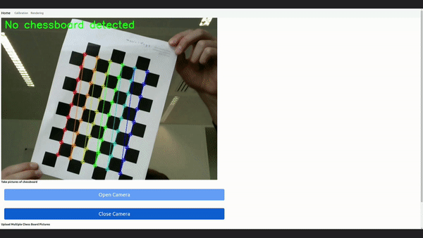
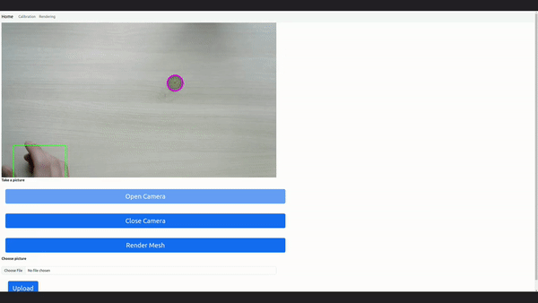
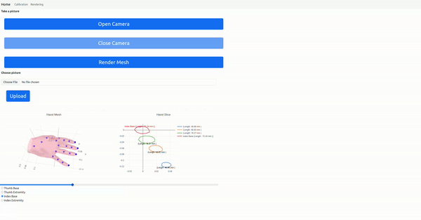
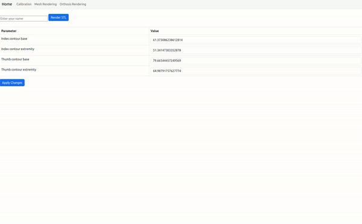

# Hand Mesh Reconstruction for Inkredable


This project is a tool built using Microsoft's open-source mesh reconstruction repo, [Mesh Graphormer](https://github.com/microsoft/MeshGraphormer). MeshGraphormer uses 224x224 images of centered hands to render hand meshes. Using the mesh and camera information, we recreate the placement of the user's hand in 3D space and find the corresponding dimensions of his fingers. An orthosis is then generated as a 3D-printable STL file for writing purposes. 

 



The paper for Microsoft's graphormer can be found [here](https://arxiv.org/abs/2104.00272).

The goal of this project was to create an open-source tool usable by people with just an rgb webcam and a reference point. We wanted to make it possible for people that had trouble writing, including people with d   isabilities, to be able to print a simple orthosis.

 


# Inkredable Mesh Reconstruction Installation


## With Docker

```bash 
git clone --recursive https://github.com/hippobo/Inkreadable-Hand-Mesh-Reconstruction.git

cd Inkreadable-Hand-Mesh-Reconstruction

docker compose build
```
This may take a long time -
all dependecies and requirements, including Blender, Apex, and pre-trained models will be installed except for MANO and SMPL.
Cuda is required on your machine (11.7 is recommended).

Install nvidia-container-toolkit on root:

```bash
1.

distribution=$(. /etc/os-release;echo $ID$VERSION_ID) \
          && curl -fsSL https://nvidia.github.io/libnvidia-container/gpgkey | sudo gpg --dearmor -o /usr/share/keyrings/nvidia-container-toolkit-keyring.gpg \
          && curl -s -L https://nvidia.github.io/libnvidia-container/$distribution/libnvidia-container.list | \
                sed 's#deb https://#deb [signed-by=/usr/share/keyrings/nvidia-container-toolkit-keyring.gpg] https://#g' | \
                sudo tee /etc/apt/sources.list.d/nvidia-container-toolkit.list
2.
    sudo apt-get update
    sudo apt-get install -y nvidia-container-toolkit
    sudo nvidia-ctk runtime configure --runtime=docker
    sudo systemctl restart docker
```

Run the container :

```bash
docker compose up 
```

Stop the container :

```bash
docker compose down
```
This will start a local flask webapp on http://localhost:5000. Go to the botton of this README for more information.

## Without Docker 
MeshGraphormer is developed based on Ubuntu 16.04 and NVIDIA GPU cards. 

### Requirements
- Python 3.7
- Pytorch 1.13
- torchvision 0.14.0
- cuda 11.7

### Setup with Conda

Create a new conda environment and install all the relevant dependencies. 

```bash
# Create a new conda environment
conda create --name gphmr python=3.7
conda activate gphmr

# Install Pytorch with cuda 
pip install torch==1.13.0+cu117 torchvision==0.14.0+cu117 torchaudio==0.13.0 --extra-index-url https://download.pytorch.org/whl/cu117

export INSTALL_DIR=$PWD

# Install apex
cd $INSTALL_DIR
git clone https://github.com/ptrblck/apex.git
cd apex
python setup.py install --cuda_ext --cpp_ext

# Install MeshGraphormer
cd $INSTALL_DIR
git clone --recursive git@github.com:hippobo/Inkreadable-Hand-Mesh-Reconstruction.git
cd Inkreadable-Hand-Mesh-Reconstruction
python setup.py build develop

# Install requirements
pip install -r requirements.txt

# Install manopth
cd $INSTALL_DIR
cd Inkreadable-Hand-Mesh-Reconstruction
pip install ./manopth/.

unset INSTALL_DIR
```
### Download Blender for rendering STL file for the orthosis

 ```bash
    cd $REPO_DIR
    bash scripts/download_blender_linux.sh

```

### Create crucial directories 


 ```bash
    cd $REPO_DIR
    bash scripts/create_dirs.sh


```

## Model Downloads


### Getting Started

1. Create folder that store pretrained model
    ```bash
    export REPO_DIR=$PWD
    mkdir -p $REPO_DIR/models  # pre-trained models
    ```

2. Download pretrained model.

    The pre-trained model can be downloaded with the following command.
    ```bash
    cd $REPO_DIR
    bash scripts/download_models.sh
    ```
   This script will also download HRNet pre-trained weights.

    The resulting data structure should follow the hierarchy as below. 
    ```
    ${REPO_DIR}  
    |-- models  
    |   |-- graphormer_release
    |   |   |-- graphormer_hand_state_dict.bin
    |   |-- hrnet
    |   |   |-- hrnetv2_w64_imagenet_pretrained.pth
    |   |   |-- cls_hrnet_w64_sgd_lr5e-2_wd1e-4_bs32_x100.yaml
    |-- src  
    |-- README.md 
    |-- ... 
    |-- ... 
    ```

3. Download SMPL and MANO models from their official websites

    Visit the following websites to download SMPL and MANO models. 

    - Download `basicModel_neutral_lbs_10_207_0_v1.0.0.pkl` from [SMPLify](http://smplify.is.tue.mpg.de/), and place it at `${REPO_DIR}/src/modeling/data`.
    - Download `MANO_RIGHT.pkl` from [MANO](https://mano.is.tue.mpg.de/), and place it at `${REPO_DIR}/src/modeling/data`.

    Please put the downloaded files under the `${REPO_DIR}/src/modeling/data` directory. The data structure should follow the hierarchy below. 
    ```
    ${REPO_DIR}  
    |-- src  
    |   |-- modeling
    |   |   |-- data
    |   |   |   |-- basicModel_neutral_lbs_10_207_0_v1.0.0.pkl
    |   |   |   |-- MANO_RIGHT.pkl
    |-- models
    |-- datasets
    |-- predictions
    |-- README.md 
    |-- ... 
    |-- ... 
    ```
## Demo 

### Camera calibration
To run the code, first calibrate your camera by printing out the opencv chessboard pattern at ``` ./samples/OpenCV_Chessboard/pattern.png ``` And taking various pictures, around 10, at different angles like this: 
.

Place the pictures at ```./samples/Chessboard_Images ```
Then run ```./src/utils/camera_calibration.py``` :
```python 
python3 camera_calibration.py --dir ./samples/Chessboard_Images/ --square_size 0.024 --width 9 --height 6 
```

### Inference

Once calibration is done, place a 2 euro coin on a table, lay your hand flat against the table and place your webcam parallel to the surface. 
Run 
```python
python ./src/tools/run_gphmer_handmesh_inference.py
```
Your hand and coin will both be detected automatically. Press q when picture is taken to run inference. You now have your hand measurements. You can input them [here](https://project.inria.fr/humanlabinria/fr/inkredable/) to generate an STL file for printing. 

Output : 

 


## Flask webapp 


To run the webapp locally, run :
```python
python src/flask_app/app.py
```

1. Before running inference, click the "Calibration" button on the webapp. Print out this OpenCV chessboard from [here](https://visp-doc.inria.fr/download/calib-grid/OpenCV_Chessboard.pdf) and tape it on to a flat surface like a piece of cardboard. Click "Open Camera" and follow instructions.


2. To start running inference, you can choose to either automatically take a picture, of your hand laying on the table next to a 2 euro coin, or choose your own picture. To take the picture, place your camera parallel to the surface on which you place your hand. Open the camera and wait until both your hand and coin are detected. A message should appear saying a picture was taken. You can now click "Render Mesh". This could take some time. You can now see your rendered 3D mesh and slices. Measurements are automatically taken.

3. To Download your STL, go to the "Orthosis Rendering" tab and enter your name. Once the orthosis is rendered, you can download it and print it using the slicer and printer of your choice ! 


Calibration with OpenCV Chessboard

 


Hand/Coin detection




Hand Mesh rendering and slicing




Custom STL File Rendering, Modifying and Download




